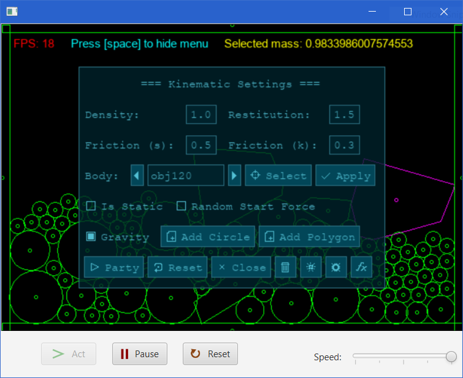

# Bouncy Code!

Thanks to the amazing team for their hard work! Here's a screenie:

Try our new space heater application! Run it and it will turn your computer into a nice toasty space heater!

### Some fun things to try out:
- Turn off gravity, turn on "random start force" and press the large explosion button and watch everything turn into chaos!
- Enter -1 as the density then press "Add Circle" and watch negative mass physics work its magic!
- Press party to break your machine!
- Press the small explosion between the trash can and large explosion icon to simulate particles!
- Tweak settings around:
    - Friction should be (0, 1) but what if you increased it?
    - Resitution should be (2, 3) but what if you increased it?
- Try moving bodies around while the simulation is running!

### Its not a bug, its an undocumented feature!
- Polygons with flat geometry WILL CAUSE HAVOC. They will bounce around and teleport.
    - **We know this is an issue.** The reason is because we use a cheap collision resolution
    technique called MPR (Minkowski Portal Refinement) instead of the traditional GJK algorithm.
    We got **lazy** and used MPR to identify "collision points" (instead of using a proper algorithm).
    This is **very inaccurate** and will result in the behaviour seen.
- Fast moving objects will pass through walls and disappear.
    - This issue can be solved with a CCD (continuous collision detector). They are not
    trivial to write. Just deal with it.
